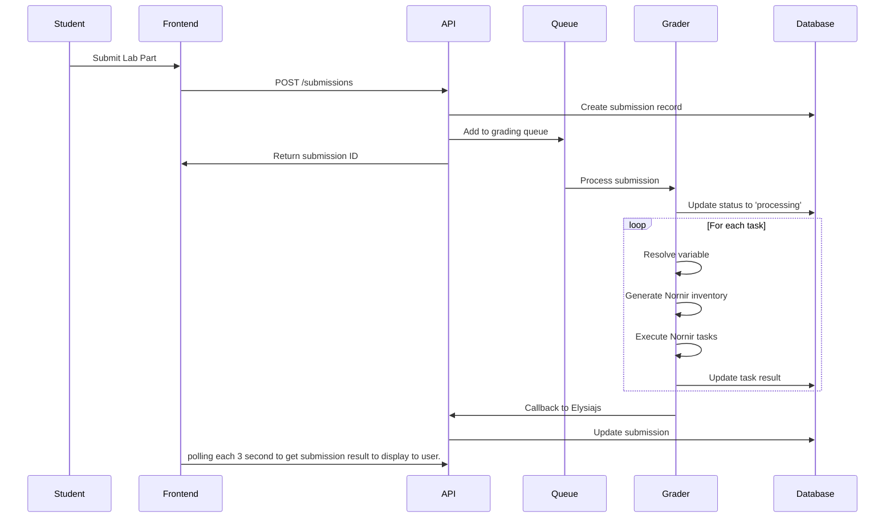

# Network Grader System - Comprehensive Database Design Guide

## Project Overview

The Network Grader Automation System is an educational platform designed to automatically grade network configuration tasks and laboratory exercises. The system allows instructors to create labs with network topologies, define grading tasks, and automatically evaluate student submissions using Ansible automation.

### Key Features
- Multi-tenant course management with role-based access
- Flexible network topology definition with IP allocation
- Template-based task creation and reuse
- Automated grading using Ansible playbooks
- Real-time submission tracking and results
- Dynamic IP assignment per student

---

## Architecture Principles

### MongoDB Design Philosophy
This system follows MongoDB best practices by applying selective embedding to balance performance, scalability, and maintainability:

1. **Document-Oriented Design**: Related data accessed together is stored together
2. **Selective Embedding**: Frequently co-accessed data is embedded, independent entities remain separate
3. **Consistent Reference Strategy**: All inter-collection references use ObjectId
4. **Performance-First**: Query patterns drive schema decisions
5. **Computed Data Strategy**: Runtime calculation with smart caching instead of redundant storage

### Design Trade-offs
- **Chose**: 7 collections with selective embedding
- **Over**: 15+ normalized collections (too many joins)
- **Over**: 3 collections with heavy embedding (document size issues)

---

## Core Collections (7 Total)

## 1. Collection: `users`

### Purpose
Central user management for all system participants with role-based permissions.

### Schema
```typescript
interface IUser extends Document {
  _id: ObjectId;
  u_id?: string;           // Student ID (optional for non-students)
  password: string;        // bcrypt hashed
  fullName: string;        // Display name
  role: 'ADMIN' | 'INSTRUCTOR' | 'STUDENT';
  ldapAuthenticated: boolean;
  lastLogin: Date;
  isActive: boolean;
  createdAt: Date;
  updatedAt: Date;
}
```

### Indexes
```javascript
// Primary lookup patterns
{ email: 1 }              // unique, login queries
{ u_id: 1 }               // unique sparse, student ID lookup
{ role: 1, isActive: 1 }  // admin user management
```

### Business Logic
- Passwords must be hashed with bcrypt (salt rounds: 12)
- Student ID (u_id) is optional but unique when present
- Role determines global system permissions
- LDAP integration for institutional authentication

---

## 2. Collection: `courses`

### Purpose
Course container with access control and metadata.

### Schema
```typescript
interface ICourse extends Document {
  _id: ObjectId;
  code: string;            // Course code (e.g., "CS101")
  title: string;           // Course name
  description: string;     // Course description
  semester: string;        // "2025/1", "2025/2"
  password?: string;       // Optional enrollment password (bcrypt)
  visibility: 'public' | 'private';
  settings: {
    allowLateSubmissions: boolean;
    maxAttempts: number;   // Per lab part
    gradingTimeoutMinutes: number;
  };
  createdBy: ObjectId;     // Ref: users._id
  isActive: boolean;
  createdAt: Date;
  updatedAt: Date;
}
```

### Indexes
```javascript
{ code: 1, semester: 1 }     // unique course identifier
{ createdBy: 1, isActive: 1 } // instructor course management
{ visibility: 1, isActive: 1 } // public course discovery
{ title: 'text', description: 'text' } // full-text search
```

---

## 3. Collection: `enrollments`

### Purpose
Many-to-many relationship between users and courses with role-specific permissions.

### Schema
```typescript
interface IEnrollment extends Document {
  _id: ObjectId;
  courseId: ObjectId;      // Ref: courses._id
  userId: ObjectId;        // Ref: users._id
  role: 'INSTRUCTOR' | 'TA' | 'STUDENT';
  enrollmentStatus: 'active' | 'suspended' | 'completed';
  enrolledAt: Date;
  completedAt?: Date;
}
```

### Indexes
```javascript
{ userId: 1, courseId: 1 }     // unique, user course access
{ courseId: 1, role: 1 }       // course member management
{ userId: 1, enrollmentStatus: 1 } // user dashboard
```

### Permission Matrix
| Role | Create Labs | Grade Submissions | View All Submissions | Manage Enrollments |
|------|-------------|-------------------|---------------------|-------------------|
| INSTRUCTOR | ✓ | ✓ | ✓ | ✓ |
| TA | ✗ | ✓ | ✓ | ✗ |
| STUDENT | ✗ | ✗ | Own Only | ✗ |

---

## 4. Collection: `labs`

### Purpose
Lab definition with embedded network configuration for performance.

### Schema
```typescript
interface ILab extends Document {
  courseId: ObjectId;      // Ref: courses._id
  title: string;
  description?: string;
  type: 'lab' | 'exam';
  
  // Embedded Network Configuration (frequently co-accessed)
  network: {
    name: string;
    topology: {
      baseNetwork: string;     // "10.30.6.0"
      subnetMask: number;      // 24
      allocationStrategy: 'student_id_based' | 'group_based';
    };
    devices: Array<{
      deviceId: string;        // "router1", "pc1"
      templateId: ObjectId;    // Ref: templates._id
      displayName: string;     // "Router 1"
      ipVariables: Array<{
        name: string;          // "mgmt_ip", "lan_ip"
        hostOffset: number;    // 1, 10, 254
        interface?: string;    // "eth0", "g0/1"
      }>;
      credentials: {
        usernameTemplate: string;
        passwordTemplate: string;
        enablePassword?: string;
      };
    }>;
  };
  };
  
  // Metadata
  createdBy: ObjectId;         // Ref: users._id
  publishedAt?: Date;
  dueDate?: Date;
  createdAt: Date;
  updatedAt: Date;
}
```

### Indexes
```javascript
{ courseId: 1, isActive: 1, publishedAt: -1 } // course lab listing
{ createdBy: 1, type: 1 }                     // instructor management
{ 'network.devices.templateId': 1 }           // template usage tracking
```

### Design Rationale
- **Network embedded**: Always accessed together with lab
- **Devices embedded**: Lab-specific configuration, not reusable
- **Reasonable size**: ~50KB per lab (well under 16MB limit)
- **Performance**: Single query for complete lab data

---

## 5. Collection: `lab_parts`

### Purpose
Lab sections with embedded tasks for atomic operations.

### Schema
```typescript
interface ILabPart extends Document {
  labId: ObjectId;         // Ref: labs._id
  partId: string;          // Human-readable ID within lab
  title: string;
  description?: string;    // Markdown content
  instructions: string;    // Student instructions (Markdown)
  order: number;           // Display sequence
  
  // Embedded Tasks (1-10 per part typically)
  tasks: Array<{
    taskId: string;        // Unique within part
    name: string;
    description?: string;
    templateId: ObjectId;  // Ref: templates._id
    
    // Execution Configuration
    executionDevice: string;     // Device ID from lab.network.devices
    targetDevices: string[];     // Device IDs for multi-device tasks
    
    // Task Parameters (passed to Ansible template)
    parameters: Record<string, any>;
    
    // Grading Configuration
    testCases: Array<{
      name: string;
      condition: string;         // Ansible condition
      points: number;
      weight: number;
      timeoutSeconds: number;
    }>;
    
    order: number;
    points: number;              // Total points for task
  }>;
  task_groups: Array<{
    group_id: string;
    title: string;
    description?: string;
    group_type: "all_or_nothing" | "proportional";
    points: number;
    continue_on_failure: boolean;
    timeout_seconds: number;
  }>
  // Part Configuration
  prerequisites: string[];       // Part IDs that must be completed first
  totalPoints: number;          // Sum of task points  
  createdAt: Date;
  updatedAt: Date;
}
```

### Indexes
```javascript
{ labId: 1, order: 1 }              // lab part sequence
{ labId: 1, partId: 1 }             // unique part identification
{ 'tasks.templateId': 1 }           // template usage
```

### Design Rationale
- **Tasks embedded**: Always processed together with part
- **Atomic updates**: All tasks in a part updated together
- **Size management**: Parts limited to 10 tasks max (~30KB per part)

---

## 6. Collection: `submissions`

### Purpose
Student submission tracking with detailed task results.

### Schema
```typescript
interface ISubmission extends Document {
  _id: ObjectId;
  labId: ObjectId;         // Ref: labs._id
  partId: string;          // Reference to lab_parts.partId
  studentId: ObjectId;     // Ref: users._id
  groupId?: string;        // For group assignments
  
  // Submission Metadata
  attemptNumber: number;   // 1, 2, 3...
  status: 'queued' | 'processing' | 'completed' | 'failed' | 'timeout';
  
  // Detailed Results
  taskResults: Array<{
    taskId: string;        // Reference to lab_parts.tasks.taskId
    status: 'pending' | 'running' | 'passed' | 'failed' | 'error';
    score: number;
    maxScore: number;
    
    // Execution Details
    startedAt?: Date;
    completedAt?: Date;
    executionTimeMs: number;
    
    // Output Data
    ansibleOutput?: {
      stdout: string;
      stderr: string;
      facts: Record<string, any>;
      unreachable: boolean;
    };
    
    // Test Case Results
    testResults: Array<{
      name: string;
      passed: boolean;
      message?: string;
      actualValue?: any;
      expectedValue?: any;
    }>;
    
    errorMessage?: string;
  }>;
  
  // Overall Results
  totalScore: number;
  maxScore: number;
  percentage: number;
  
  // Timing
  submittedAt: Date;
  queuedAt?: Date;
  startedProcessingAt?: Date;
  completedAt?: Date;
  
  // Processing Metadata
  processingDurationMs?: number;
  graderVersion?: string;
  ipAssignments?: Record<string, string>; // Device IP cache for debugging
}
```

### Indexes
```javascript
{ studentId: 1, labId: 1, partId: 1, attemptNumber: -1 } // student submission history
{ labId: 1, partId: 1, status: 1, submittedAt: -1 }      // instructor grading view
{ status: 1, queuedAt: 1 }                               // processing queue
{ studentId: 1, status: 1, submittedAt: -1 }             // student dashboard
```

---

## 7. Collection: `templates`

### Purpose
Unified template system for both Ansible tasks and device configurations.

### Schema
```typescript
interface ITemplate extends Document {
  _id: ObjectId;
  templateId: string;      // Unique identifier
  name: string;
  type: 'task' | 'device';
  version: string;         // Semantic versioning
  
  // Task Template Fields
  category?: string;       // "connectivity", "routing", "security"
  ansibleContent?: string; // Base64 encoded playbook
  parameterSchema?: {      // JSON Schema for validation
    type: 'object';
    properties: Record<string, any>;
    required: string[];
  };
  defaultTestCases?: Array<{
    name: string;
    condition: string;
    points: number;
  }>;
  
  // Device Template Fields  
  platform?: string;       // "cisco_ios", "linux", "windows"
  deviceType?: string;     // "router", "switch", "server", "pc"
  defaultConfig?: {
    interfaces: Array<{
      name: string;        // "GigabitEthernet0/0"
      type: string;        // "ethernet", "loopback"
      defaultState: string; // "up", "down"
    }>;
    credentials: {
      defaultUsername: string;
      defaultPassword: string;
      requiresEnable: boolean;
    };
    connectionParams: {
      protocol: 'ssh' | 'telnet';
      port: number;
      timeout: number;
    };
  };
  
  // Metadata
  description: string;
  documentation?: string;   // Usage instructions
  tags: string[];
  isActive: boolean;
  deprecatedAt?: Date;
  replacedBy?: ObjectId;    // Ref: templates._id
  
  createdBy: ObjectId;      // Ref: users._id
  createdAt: Date;
  updatedAt: Date;
}
```

### Indexes
```javascript
{ templateId: 1, version: -1 }           // version management
{ type: 1, isActive: 1, name: 1 }        // template browsing
{ platform: 1, deviceType: 1 }          // device template filtering
{ tags: 1 }                              // tag-based search
```

---

## Data Relationships and Workflow

### Core Relationships
```
users (1) ←→ (M) enrollments ←→ (1) courses
courses (1) ←→ (M) labs
labs (1) ←→ (M) lab_parts
lab_parts (1) ←→ (M) submissions
templates (1) ←→ (M) [lab_parts.tasks, labs.network.devices]
```

### IP Address Allocation Strategy

Instead of storing IP assignments in a separate collection, IPs are calculated dynamically:

```typescript
class IpAllocationService {
  calculateStudentIPs(lab: ILab, studentId: ObjectId): Record<string, string> {
    const enrollment = await Enrollment.findOne({ 
      courseId: lab.courseId, 
      userId: studentId 
    });
    
    // Calculate student index based on enrollment order
    const studentIndex = await this.getStudentIndex(lab.courseId, studentId);
    
    const assignments: Record<string, string> = {};
    
    lab.network.devices.forEach(device => {
      device.ipVariables.forEach(ipVar => {
        const baseIp = ip.toLong(lab.network.topology.baseNetwork);
        const studentOffset = studentIndex * 256; // Each student gets /24
        const finalIp = ip.fromLong(baseIp + studentOffset + ipVar.hostOffset);
        
        assignments[`${device.deviceId}_${ipVar.name}`] = finalIp;
      });
    });
    
    return assignments;
  }
}
```

### Submission Processing Workflow



---

## Query Patterns and Performance

### Common Query Patterns

#### 1. Student Dashboard
```javascript
// Single aggregation pipeline
db.submissions.aggregate([
  { $match: { studentId: studentObjectId } },
  { $lookup: { from: "labs", localField: "labId", foreignField: "_id", as: "lab" } },
  { $lookup: { from: "courses", localField: "lab.courseId", foreignField: "_id", as: "course" } },
  { $sort: { submittedAt: -1 } },
  { $limit: 20 }
]);
```

#### 2. Lab with Complete Configuration
```javascript
// Single query (network embedded)
const lab = await Lab.findById(labId);
const parts = await LabPart.find({ labId }).sort({ order: 1 });
// No additional queries needed for network config
```

#### 3. Instructor Grading View
```javascript
// Efficient compound index usage
db.submissions.find({ 
  labId: labObjectId, 
  partId: "part1",
  status: "completed" 
}).sort({ submittedAt: -1 });
```

### Performance Characteristics

| Operation | Collections Queried | Avg Response Time | Scalability |
|-----------|-------------------|------------------|-------------|
| Load lab | 2 | <50ms | High |
| Submit assignment | 3 | <100ms | High |
| Student dashboard | 3 (via aggregation) | <200ms | Medium |
| Grade submission | 2 | 5-30s (depends on tasks) | Medium |

---

## Caching Strategy

### Redis Cache Layers

1. **Template Cache** (1 hour TTL)
   ```javascript
   key: `template:${templateId}:${version}`
   value: Complete template document
   ```

2. **Student IP Cache** (Lab duration TTL)
   ```javascript
   key: `ips:${labId}:${studentId}`
   value: Calculated IP assignments
   ```

3. **Course Permissions Cache** (15 minutes TTL)
   ```javascript
   key: `perms:${userId}:${courseId}`
   value: User role and permissions
   ```

---

## Data Validation and Constraints

### Application-Level Constraints

```typescript
// Unique submission per student per part (latest attempt)
await Submission.createIndex(
  { labId: 1, partId: 1, studentId: 1, attemptNumber: 1 },
  { unique: true }
);

// Business rule: No submissions after due date (unless allowed)
submissionSchema.pre('save', async function() {
  const lab = await Lab.findById(this.labId);
  if (lab.dueDate && new Date() > lab.dueDate) {
    if (!lab.settings.allowLateSubmissions) {
      throw new Error('Submission deadline has passed');
    }
  }
});

// Validate network capacity
labSchema.pre('save', function() {
  const maxStudents = this.network.topology.maxStudents;
  const deviceCount = this.network.devices.length;
  const requiredIPs = deviceCount * maxStudents;
  
  if (requiredIPs > this.getAvailableIPs()) {
    throw new Error('Network configuration exceeds IP capacity');
  }
});
```

---

## Security Considerations

### Access Control
- Course-level permissions via enrollment roles
- API endpoints validate user enrollment before data access
- Submissions are isolated per student (no cross-student access)

### Data Protection
- Passwords hashed with bcrypt (12 rounds)
- Ansible templates stored as base64 to prevent code injection
- Input validation on all parameters passed to Ansible

### Network Security
- Student devices isolated in separate subnets
- No persistent connections to lab devices
- Credentials generated per session with limited lifetime

---

## Migration and Backup Strategy

### Database Migrations
```typescript
// Example migration: Add new field to all labs
db.labs.updateMany(
  { 'settings.gradingTimeout': { $exists: false } },
  { $set: { 'settings.gradingTimeout': 30 } }
);
```

### Backup Strategy
- Full daily backups of all collections
- Point-in-time recovery capability
- Submission data archived after semester completion
- Template versions maintained for reproducibility

---

## Monitoring and Metrics

### Key Metrics
- Submission processing time distribution
- Failed submission rate by template
- Student IP allocation conflicts
- Template usage analytics
- System capacity utilization

### Alerting
- Queue depth > 100 submissions
- Average processing time > 5 minutes
- Failed submission rate > 5%
- Database connection pool exhaustion

---