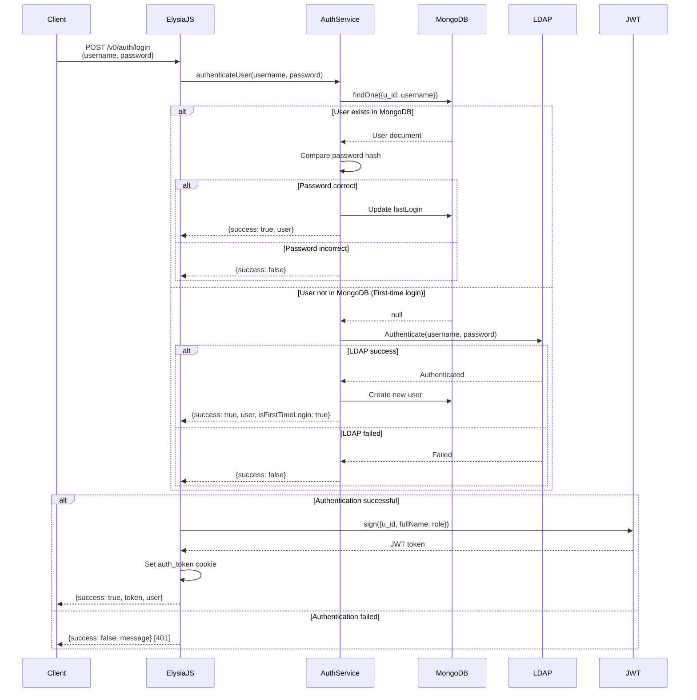
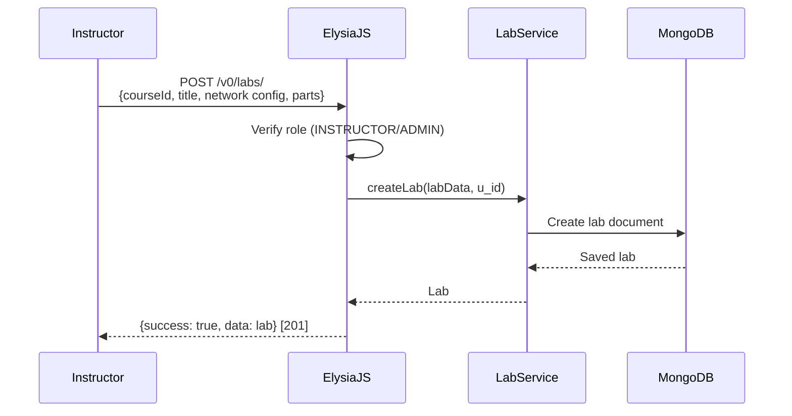
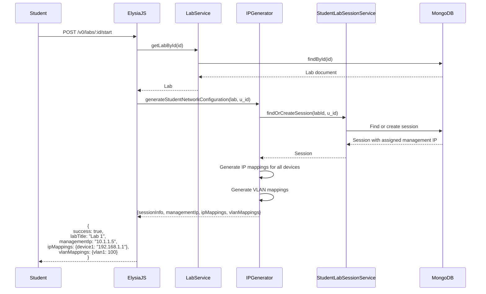
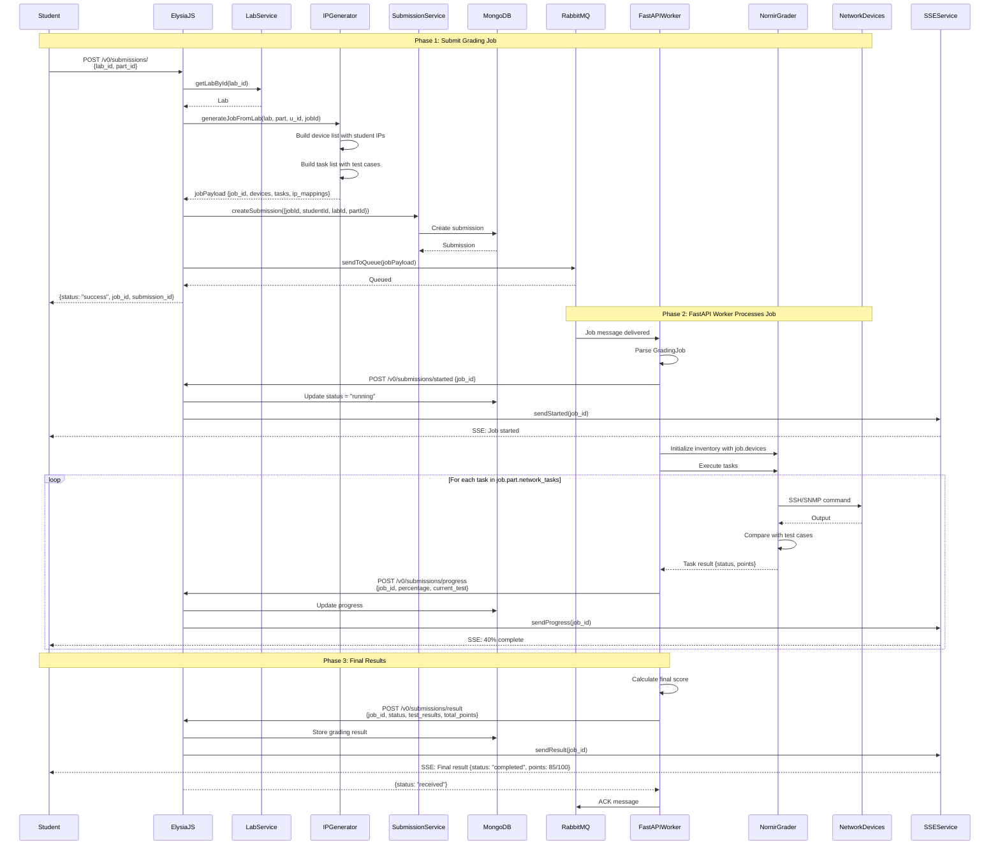
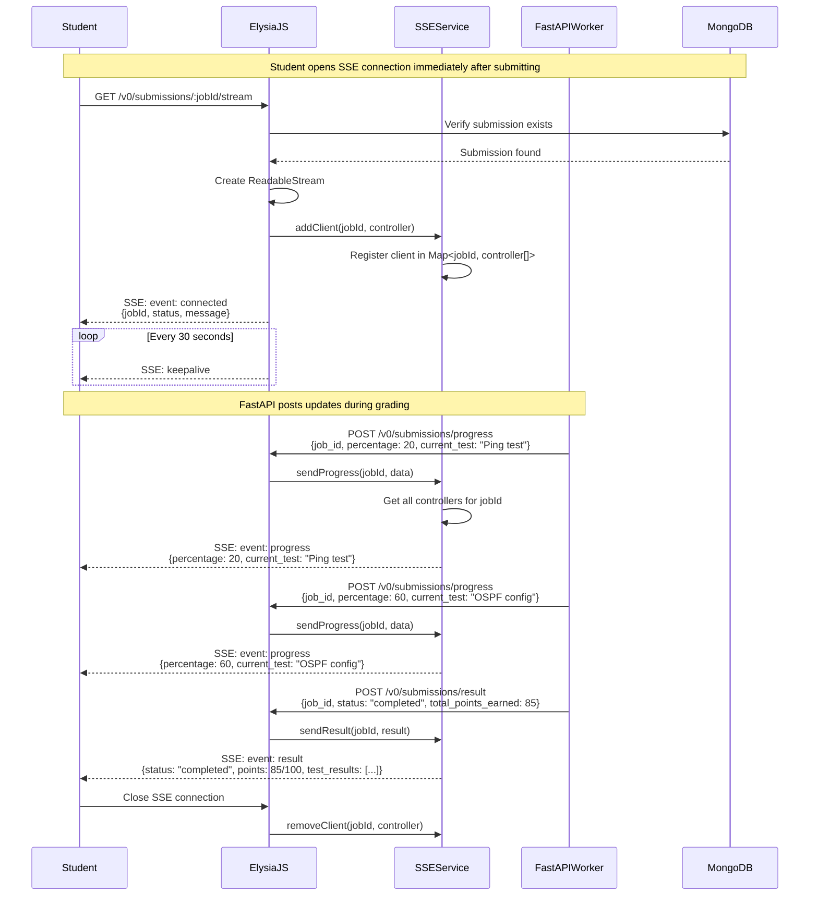
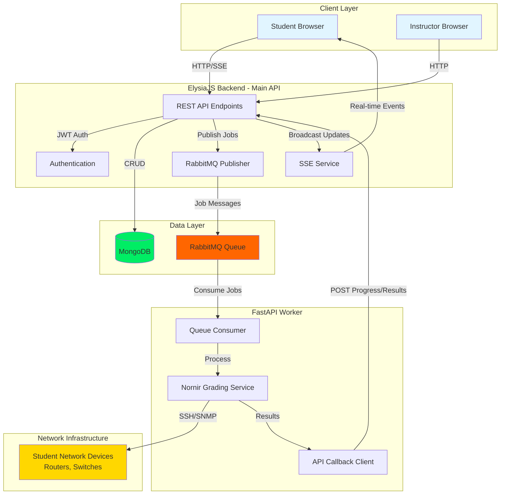

# NetGrader Backend - MVP Sequence Diagrams

This document contains Mermaid sequence diagrams for the most critical MVP flows in the NetGrader system.

## Core MVP Flows

1. [User Authentication](#1-user-authentication)
2. [Create and Start Lab](#2-create-and-start-lab)
3. [Submit Lab for Grading (End-to-End)](#3-submit-lab-for-grading-end-to-end)
4. [Real-time Progress Monitoring](#4-real-time-progress-monitoring)

---

## 1. User Authentication

### User Login Flow (POST /v0/auth/login)

---

## 2. Create and Start Lab

### Create Lab (POST /v0/labs/)

### Start Lab - Student Gets Network Configuration (POST /v0/labs/:id/start)

---

## 3. Submit Lab for Grading (End-to-End)

### Complete Grading Flow - From Submission to Result

---

## 4. Real-time Progress Monitoring

### Student Connects to SSE Stream for Live Updates

---

## MVP Architecture Overview

---

## Key MVP Features Demonstrated

1. **Authentication Flow**: MongoDB + LDAP fallback for first-time users
2. **Lab Creation**: Instructors create labs with network topology
3. **Lab Start**: Students get personalized IP addresses and network configuration
4. **Job Submission**: Student triggers grading, job queued to RabbitMQ
5. **Background Processing**: FastAPI worker consumes jobs and grades in background
6. **Real-time Updates**: SSE streams progress from worker to student
7. **Grading Results**: Complete test results stored and delivered in real-time

These 4 core flows represent the MVP functionality of the NetGrader system.
