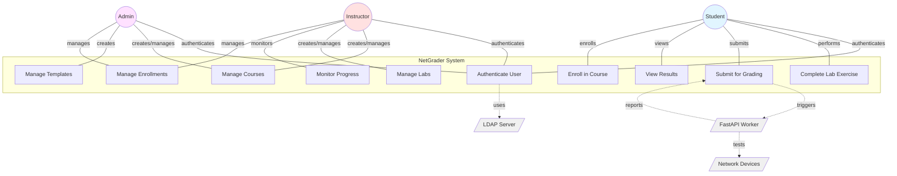
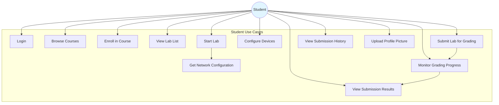
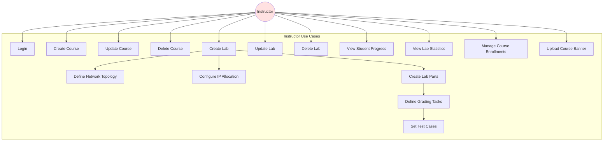
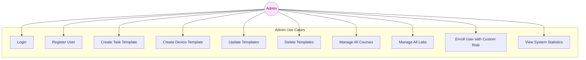

# NetGrader - Use Case Diagrams and Specifications

This document contains use case diagrams and detailed specifications for the NetGrader system.

## Table of Contents

1. [System Overview](#system-overview)
2. [Actors](#actors)
3. [Use Case Diagrams](#use-case-diagrams)
4. [Use Case Specifications](#use-case-specifications)

---

## System Overview

NetGrader is an automated network laboratory grading system that allows instructors to create network labs and automatically grade student submissions using real network device testing.

---

## Actors

### Primary Actors

| Actor | Description | Responsibilities |
|-------|-------------|------------------|
| **Student** | Enrolled user taking network labs | - Complete lab exercises<br/>- Submit configurations for grading<br/>- View results and feedback |
| **Instructor** | Course creator and lab designer | - Create and manage courses<br/>- Design network labs and topologies<br/>- Create grading tasks and test cases<br/>- Monitor student progress |
| **Admin** | System administrator | - Manage users and permissions<br/>- Create templates<br/>- System configuration<br/>- Enroll users with custom roles |

### Secondary Actors

| Actor | Description |
|-------|-------------|
| **LDAP Server** | External authentication service for first-time logins |
| **Network Devices** | Routers, switches being tested (e.g., Cisco, Linux servers) |
| **FastAPI Worker** | Background grading service that executes tests |

---

## Use Case Diagrams

### 1. System-Level Use Case Diagram



### 2. Student Use Case Diagram



### 3. Instructor Use Case Diagram



### 4. Admin Use Case Diagram



---

## Use Case Specifications

### UC-001: User Authentication

**Use Case Name:** User Authentication
**Actor:** Student, Instructor, Admin
**Goal:** Authenticate user and grant access to the system
**Preconditions:** User has valid credentials
**Postconditions:** User is authenticated and receives JWT token

#### Main Flow:
1. User navigates to login page
2. User enters username and password
3. System checks MongoDB for existing user
4. If user exists, system validates password hash
5. If password correct, system updates lastLogin timestamp
6. System generates JWT token with user information
7. System sets auth_token cookie
8. System returns user profile and token
9. User is redirected to dashboard

#### Alternate Flow 1A: First-time Login (LDAP)
3a. User not found in MongoDB
3b. System attempts LDAP authentication
3c. If LDAP successful:
   - System creates new user in MongoDB
   - Marks user as ldapAuthenticated
   - Sets isFirstTimeLogin flag
   - Continues from step 6

#### Alternate Flow 1B: Authentication Failed
4a. Password incorrect or LDAP failed
4b. System returns 401 Unauthorized
4c. System displays error message
4d. User can retry login

**Business Rules:**
- JWT token expires after 24 hours
- LDAP is only consulted for new users
- Password is hashed using bcrypt

**Related Endpoints:**
- `POST /v0/auth/login`
- `GET /v0/auth/me`
- `POST /v0/auth/logout`

---

### UC-002: Create Lab

**Use Case Name:** Create Lab
**Actor:** Instructor, Admin
**Goal:** Create a new network lab with topology and grading configuration
**Preconditions:**
- User is authenticated
- User has INSTRUCTOR or ADMIN role
- User is enrolled in the course

**Postconditions:**
- Lab is created and stored in database
- Lab is available for students to start

#### Main Flow:
1. Instructor navigates to course page
2. Instructor clicks "Create Lab"
3. Instructor enters lab details:
   - Title and description
   - Lab type (lab/exam)
   - Availability dates
4. Instructor defines network topology:
   - Base network (e.g., 10.1.0.0/16)
   - Subnet mask
   - Allocation strategy (student_id_based/group_based)
   - Exempt IP ranges (optional)
5. Instructor configures VLAN settings (optional):
   - VLAN mode (fixed/lecturer_group/calculated)
   - VLAN count and details
6. Instructor adds network devices:
   - Device ID and template
   - IP variables for each interface
   - Credentials (username/password templates)
7. System validates VLAN configuration
8. System validates exempt IP ranges
9. System validates IP variables for conflicts
10. System calculates IP capacity
11. If capacity sufficient, system creates lab
12. System confirms lab creation
13. Instructor can now create parts for the lab

#### Alternate Flow 2A: VLAN Validation Failed
7a. VLAN configuration invalid
7b. System returns validation errors
7c. System highlights problematic fields
7d. Instructor corrects errors and resubmits

#### Alternate Flow 2B: Insufficient IP Capacity
10a. Not enough IPs for enrolled students
10b. System calculates shortage
10c. System suggests:
   - Reduce exempt ranges by X IPs
   - Expand management network
10d. System deletes partially created lab
10e. Instructor adjusts configuration and retries

#### Alternate Flow 2C: Duplicate IP Configuration
9a. Multiple devices configured with same IP
9b. System identifies duplicate configurations
9c. System returns error with device details
9d. Instructor resolves conflicts and resubmits

**Business Rules:**
- Each lab must belong to a course
- Management network must have enough IPs for all enrolled students
- VLAN IDs must be between 1-4094
- Exempt IP ranges must be within base network
- Device IDs must be unique within a lab

**Related Endpoints:**
- `POST /v0/labs/`
- `GET /v0/labs/:id`
- `PUT /v0/labs/:id`

---

### UC-003: Start Lab (Get Network Configuration)

**Use Case Name:** Start Lab
**Actor:** Student
**Goal:** Generate and receive personalized network configuration for the lab
**Preconditions:**
- User is authenticated
- User is enrolled in the course
- Lab exists and is published
- Lab is within availability window

**Postconditions:**
- Student receives unique management IP
- Student receives IP mappings for all devices
- Student receives VLAN mappings (if applicable)
- Session is created/retrieved from database

#### Main Flow:
1. Student navigates to lab list
2. Student clicks "Start Lab" on desired lab
3. System retrieves lab configuration
4. System checks lab availability:
   - Published status
   - availableFrom and availableUntil dates
5. System calls IP Generator service
6. IP Generator checks for existing session:
   - If exists, retrieves existing management IP
   - If not exists, assigns new management IP
7. System generates IP mappings for all devices:
   - Management interfaces
   - VLAN interfaces
8. System generates VLAN ID mappings (if applicable):
   - Calculates VLAN IDs based on student ID
   - Applies group modifiers
9. System returns complete network configuration
10. Student views network topology with assigned IPs
11. Student uses IPs to configure physical/virtual devices

#### Alternate Flow 3A: Lab Not Published
4a. Lab not yet published
4b. System returns 403 Forbidden
4c. System displays "Lab not available yet"

#### Alternate Flow 3B: Lab Expired
4b. Current time past availableUntil
4c. System returns 403 Forbidden
4d. System displays "Lab no longer available"

#### Alternate Flow 3C: No Available IPs
6a. All management IPs assigned
6b. System cannot assign new IP
6c. System returns error
6d. System notifies instructor

**Business Rules:**
- Each student gets a unique management IP
- Management IP persists across sessions (idempotent)
- VLAN IDs calculated based on student enrollment index
- IP assignments avoid exempt ranges

**Sample Response:**
```json
{
  "success": true,
  "labTitle": "OSPF Routing Lab",
  "managementIp": "10.1.1.5",
  "ipMappings": {
    "R1": "192.168.1.5",
    "R2": "192.168.2.5",
    "SW1": "192.168.3.5"
  },
  "vlanMappings": {
    "vlan1": 105,
    "vlan2": 205
  }
}
```

**Related Endpoints:**
- `POST /v0/labs/:id/start`
- `GET /v0/labs/:id/details`

---

### UC-004: Submit Lab for Grading

**Use Case Name:** Submit Lab for Grading
**Actor:** Student
**Goal:** Submit configured lab for automated grading
**Preconditions:**
- User is authenticated and enrolled
- Lab is started and student has network configuration
- Student has configured network devices
- Lab part is available for submission

**Postconditions:**
- Submission record created in database
- Grading job queued to RabbitMQ
- FastAPI worker begins processing job
- Real-time updates available via SSE

#### Main Flow:
1. Student completes lab configuration on devices
2. Student clicks "Submit for Grading" for specific part
3. System retrieves lab and part details
4. System generates job ID (unique identifier)
5. System generates complete job payload:
   - Device list with student's assigned IPs
   - Task list with test cases
   - IP mappings for dynamic replacement
6. System creates submission record in database:
   - Status: "pending"
   - Student ID, Lab ID, Part ID
   - Timestamp
7. System publishes job to RabbitMQ queue
8. System returns submission ID and job ID to student
9. Student is redirected to grading progress page
10. FastAPI worker picks up job from queue
11. Worker posts "job started" callback to ElysiaJS
12. ElysiaJS updates submission status to "running"
13. ElysiaJS broadcasts "started" event via SSE
14. Student sees "Grading in progress" message

#### Alternate Flow 4A: Lab/Part Not Found
3a. Lab or part doesn't exist
3b. System returns 404 Not Found
3c. System displays error message

#### Alternate Flow 4B: RabbitMQ Unavailable
7a. RabbitMQ connection failed
7b. System returns 503 Service Unavailable
7c. System displays "Grading service temporarily unavailable"
7d. Student can retry later

#### Alternate Flow 4C: Multiple Submissions
2a. Student already has pending submission for this part
2b. System allows new submission (creates new record)
2c. Previous submission remains in history

**Business Rules:**
- Students can submit multiple times for same part
- Each submission gets unique job ID
- Job payload includes all test cases for the part
- Jobs processed in FIFO order by worker

**Job Payload Structure:**
```json
{
  "job_id": "student1-lab1-part1-1234567890",
  "student_id": "student1",
  "lab_id": "lab1",
  "part_id": "part1",
  "devices": [
    {
      "device_id": "R1",
      "ip_address": "192.168.1.5",
      "username": "admin",
      "password": "cisco123"
    }
  ],
  "tasks": [
    {
      "task_id": "task1",
      "name": "Verify OSPF Neighbors",
      "template": "ssh_command",
      "execution_device": "R1",
      "parameters": {
        "command": "show ip ospf neighbor"
      },
      "test_cases": [
        {
          "comparison_type": "contains",
          "expected_result": "FULL"
        }
      ],
      "points": 10
    }
  ]
}
```

**Related Endpoints:**
- `POST /v0/submissions/`
- `GET /v0/submissions/:jobId`

---

### UC-005: Monitor Grading Progress (Real-time)

**Use Case Name:** Monitor Grading Progress
**Actor:** Student
**Goal:** View real-time progress updates as lab is being graded
**Preconditions:**
- Student has submitted lab for grading
- Student has valid job ID
- Grading is in progress or completed

**Postconditions:**
- Student receives real-time updates
- Student sees final results when grading completes
- SSE connection properly closed

#### Main Flow:
1. Student submits lab (from UC-004)
2. System redirects to grading progress page
3. Browser establishes SSE connection to `/v0/submissions/:jobId/stream`
4. System verifies submission exists
5. System creates readable stream
6. System registers student's connection in SSE Service
7. System sends initial "connected" event with current status
8. System sends keepalive messages every 30 seconds
9. **Meanwhile, FastAPI Worker is processing:**
   - Worker executes task 1
   - Worker posts progress (20%)
   - ElysiaJS receives callback
   - ElysiaJS updates MongoDB
   - ElysiaJS calls SSEService.sendProgress()
   - SSEService broadcasts to all connected clients
   - Student sees: "Progress: 20% - Verifying OSPF neighbors"
10. Worker continues with remaining tasks
11. For each task, worker posts progress update (40%, 60%, 80%)
12. Student sees progress bar updating in real-time
13. Worker completes all tasks and posts final result
14. ElysiaJS stores result in MongoDB
15. ElysiaJS broadcasts "result" event via SSE
16. Student sees final results:
    - Total score (e.g., 85/100)
    - Status (completed/failed)
    - Individual test results
17. Student can close connection or it auto-closes

#### Alternate Flow 5A: Already Completed
7a. Submission already completed when SSE connects
7b. System immediately sends final result
7c. Connection closes after result delivered

#### Alternate Flow 5B: Connection Lost
9a. Network interruption
9b. Browser automatically reconnects
9c. System sends current progress state
9d. Updates resume

#### Alternate Flow 5C: Grading Failed
13a. Worker encounters critical error
13b. Worker posts error result
13c. System broadcasts error event
13d. Student sees "Grading failed: [error message]"

**Business Rules:**
- Multiple clients can connect to same job ID
- Keepalive prevents timeout on long-running jobs
- Progress percentage calculated as: (completed_tasks / total_tasks) * 100
- Results persist in database even after SSE closes

**SSE Event Types:**

```
Event: connected
Data: {"jobId": "job123", "status": "running", "message": "Connected"}

Event: progress
Data: {"percentage": 40, "current_test": "Verify BGP routing", "tests_completed": 2, "total_tests": 5}

Event: result
Data: {
  "status": "completed",
  "total_points_earned": 85,
  "total_points_possible": 100,
  "test_results": [...]
}
```

**Related Endpoints:**
- `GET /v0/submissions/:jobId/stream` (SSE)
- `POST /v0/submissions/progress` (Worker callback)
- `POST /v0/submissions/result` (Worker callback)

---

### UC-006: View Submission Results

**Use Case Name:** View Submission Results
**Actor:** Student
**Goal:** View detailed results of a grading submission
**Preconditions:**
- Submission exists
- Grading is completed
- User has access to the submission

**Postconditions:**
- User views complete grading report
- User understands which tests passed/failed

#### Main Flow:
1. Student navigates to submission history
2. Student clicks on specific submission
3. System retrieves submission by ID
4. System returns detailed results including:
   - Overall status and score
   - Execution time
   - Individual test results
   - Raw output from network devices (if available)
   - Debug information
5. Student views results breakdown:
   - Test name
   - Status (passed/failed/error)
   - Points earned/possible
   - Expected vs actual output
6. Student can review test case details
7. Student identifies areas for improvement

#### Result Structure:
```json
{
  "submission_id": "sub123",
  "job_id": "job123",
  "status": "completed",
  "total_points_earned": 85,
  "total_points_possible": 100,
  "test_results": [
    {
      "test_name": "Verify OSPF Neighbors",
      "status": "passed",
      "points_earned": 10,
      "points_possible": 10,
      "message": "OSPF neighbors found in FULL state",
      "execution_time": 2.5,
      "raw_output": "Neighbor ID Pri State..."
    },
    {
      "test_name": "Check BGP Routes",
      "status": "failed",
      "points_earned": 0,
      "points_possible": 15,
      "message": "Expected BGP route not found",
      "execution_time": 1.8
    }
  ],
  "created_at": "2025-01-20T10:30:00Z",
  "completed_at": "2025-01-20T10:32:45Z"
}
```

**Related Endpoints:**
- `GET /v0/submissions/detailed/:submissionId`
- `GET /v0/submissions/:jobId`

---

### UC-007: Enroll in Course

**Use Case Name:** Enroll in Course
**Actor:** Student, Instructor (self-enroll), Admin
**Goal:** Enroll user in a course
**Preconditions:**
- User is authenticated
- Course exists and is accessible

**Postconditions:**
- Enrollment record created
- User can access course labs
- User appears in course enrollment list

#### Main Flow:
1. User browses available courses
2. User selects a course
3. System displays course details and enrollment status
4. User clicks "Enroll"
5. System checks if course requires password
6. If password required, user enters password
7. System validates password
8. System determines enrollment role:
   - If user is Admin: Must specify role (STUDENT/INSTRUCTOR)
   - If user is not Admin: Uses user's default role
9. System checks for existing enrollment
10. System creates enrollment record
11. System confirms successful enrollment
12. User can now access course labs

#### Alternate Flow 7A: Password Required
6a. Course has password protection
6b. System prompts for password
6c. User enters password
6d. If incorrect, system rejects enrollment
6e. User can retry

#### Alternate Flow 7B: Already Enrolled
9a. User already enrolled in course
9b. System returns error "Already enrolled"
9c. System displays enrollment date

#### Alternate Flow 7C: Admin Enrollment
8a. Admin enrolling in course
8b. Admin must select role (STUDENT/INSTRUCTOR)
8c. System creates enrollment with selected role

**Business Rules:**
- Students automatically get STUDENT role
- Instructors can enroll as INSTRUCTOR
- Admins must explicitly choose role
- Non-admins cannot specify custom roles
- Course password is optional (only for private courses)

**Related Endpoints:**
- `POST /v0/enrollments/`
- `GET /v0/enrollments/status/:c_id`

---

### UC-008: Create Lab Part with Tasks

**Use Case Name:** Create Lab Part with Tasks
**Actor:** Instructor
**Goal:** Create a gradable part of a lab with specific tasks and test cases
**Preconditions:**
- Lab exists
- User has INSTRUCTOR or ADMIN role
- Task templates are available

**Postconditions:**
- Part is created with tasks
- Tasks have test cases configured
- Part is available for student submission

#### Main Flow:
1. Instructor navigates to lab details page
2. Instructor clicks "Add Part"
3. Instructor enters part details:
   - Part ID (unique within lab)
   - Title and description
   - Instructions (rich text)
   - Order/sequence number
4. Instructor adds tasks to part:
   - Select task template (e.g., "SSH Command", "SNMP Query")
   - Specify execution device
   - Specify target devices
   - Configure task parameters
5. For each task, instructor defines test cases:
   - Comparison type (equals, contains, regex, greater_than)
   - Expected result
   - Points for the test
6. Instructor configures task groups (optional):
   - All-or-nothing scoring
   - Proportional scoring
   - Dependencies between tasks
7. Instructor sets total points for part
8. System validates task configuration
9. System saves part to database
10. Part appears in lab structure
11. Students can now submit this part for grading

#### Example Task Configuration:
```json
{
  "taskId": "task1",
  "name": "Verify OSPF Configuration",
  "templateId": "ssh_command",
  "executionDevice": "R1",
  "targetDevices": ["R2"],
  "parameters": {
    "command": "show ip ospf neighbor",
    "timeout": 30
  },
  "testCases": [
    {
      "comparison_type": "contains",
      "expected_result": "FULL/DR"
    }
  ],
  "points": 15,
  "order": 1
}
```

**Business Rules:**
- Task IDs must be unique within a part
- Total points = sum of all task points (if not grouped)
- Task groups override individual task points
- Execution device must exist in lab topology
- Task templates define available parameters

**Related Endpoints:**
- `POST /v0/parts/`
- `GET /v0/parts/:id`
- `PUT /v0/parts/:id`

---

### UC-009: Monitor Student Progress (Instructor)

**Use Case Name:** Monitor Student Progress
**Actor:** Instructor
**Goal:** View real-time student progress across all lab parts
**Preconditions:**
- User is authenticated as Instructor
- Lab exists with enrolled students
- Students have started submitting labs

**Postconditions:**
- Instructor sees current progress of all students
- Instructor identifies struggling students
- Instructor can provide targeted assistance

#### Main Flow:
1. Instructor navigates to course page
2. Instructor selects specific lab
3. Instructor clicks "Student Progress"
4. System retrieves lab submission overview
5. System displays student list with:
   - Student ID and name
   - Current part they're working on
   - Latest submission status (pending/running/completed/failed)
   - Current score
   - Number of attempts
   - Last submission time
6. Instructor can sort by:
   - Progress (which part)
   - Score
   - Last activity
7. Instructor can filter by:
   - Status
   - Score range
8. Instructor clicks on student to see detailed history
9. System shows all submissions for that student:
   - Grouped by part
   - Attempts per part
   - Best score per part
   - Submission timeline
10. Instructor identifies students needing help

#### Sample Progress View:
```
Lab: OSPF Routing Configuration

Student         | Current Part | Status     | Score  | Attempts | Last Activity
----------------|--------------|------------|--------|----------|---------------
student001      | Part 3       | Completed  | 95/100 | 2        | 2 mins ago
student002      | Part 2       | Running    | 75/100 | 1        | Just now
student003      | Part 1       | Failed     | 45/100 | 5        | 10 mins ago
student004      | Part 3       | Completed  | 88/100 | 1        | 5 mins ago
```

**Business Rules:**
- Overview updates in real-time (polling every 30 seconds)
- Progress calculated as highest part completed
- Score shown is cumulative or per-part based on view
- Only instructors and admins can view progress

**Related Endpoints:**
- `GET /v0/submissions/lab/:labId` (Overview)
- `GET /v0/submissions/history/lab/:labId/student/:studentId` (Detail)

---

### UC-010: Update Lab with IP Reassignment

**Use Case Name:** Update Lab with IP Reassignment
**Actor:** Instructor
**Goal:** Update lab configuration and reassign conflicting management IPs
**Preconditions:**
- Lab exists with active student sessions
- Instructor has permission to modify lab
- New exempt IP ranges conflict with assigned IPs

**Postconditions:**
- Lab configuration updated
- Conflicting student sessions reassigned new IPs
- Students receive updated network configuration

#### Main Flow:
1. Instructor edits lab configuration
2. Instructor modifies exempt IP ranges
3. Instructor clicks "Save Changes"
4. System validates new exempt ranges
5. System checks for conflicting student sessions
6. System finds sessions with management IPs in new exempt ranges
7. System returns warning with conflict details:
   - Number of affected students
   - List of student IDs and their current IPs
   - Requires confirmation to proceed
8. System displays: "3 students will get new management IPs. Continue?"
9. Instructor reviews conflicts
10. Instructor adds `?confirmed=true` and resubmits
11. System updates lab configuration
12. System reassigns management IPs for conflicted students:
    - Finds available IPs outside exempt ranges
    - Updates session records
    - Maintains session continuity
13. System returns success with reassignment details
14. Affected students notified of IP change

#### Alternate Flow 10A: No Conflicts
6a. No student sessions conflict with new ranges
6b. System proceeds with update directly
6c. No reassignment needed

#### Alternate Flow 10B: Insufficient Capacity
11a. After reassignment, not enough IPs available
11b. System rejects update
11c. System suggests reducing exempt ranges
11d. No changes made to lab or sessions

**Business Rules:**
- Reassignment preserves student session continuity
- Students on same lab must get different IPs
- Reassignment only affects management IPs, not VLAN IPs
- Instructor must explicitly confirm reassignment

**Related Endpoints:**
- `PUT /v0/labs/:id?confirmed=true`
- `GET /v0/labs/stats/:id`

---

### UC-011: Create Task Template (Admin)

**Use Case Name:** Create Task Template
**Actor:** Admin, Instructor
**Goal:** Create reusable task template for lab creation
**Preconditions:**
- User has ADMIN or INSTRUCTOR role
- Template doesn't already exist

**Postconditions:**
- Template available for use in lab parts
- Template appears in template library

#### Main Flow:
1. Admin navigates to Templates section
2. Admin clicks "Create Task Template"
3. Admin enters template details:
   - Template ID (unique identifier)
   - Display name
   - Description (what it tests)
4. Admin defines parameter schema:
   - Parameter name, type, required flag
   - Description and validation rules
5. Admin sets default test cases:
   - Comparison types
   - Expected results
6. System validates template structure
7. System saves template to database
8. Template available for instructors to use

#### Example Template:
```json
{
  "templateId": "ssh_command",
  "name": "SSH Command Execution",
  "description": "Execute CLI command via SSH and validate output",
  "parameterSchema": [
    {
      "name": "command",
      "type": "string",
      "required": true,
      "description": "CLI command to execute"
    },
    {
      "name": "timeout",
      "type": "number",
      "required": false,
      "description": "Command timeout in seconds"
    }
  ],
  "defaultTestCases": [
    {
      "comparison_type": "success",
      "expected_result": true
    }
  ]
}
```

**Business Rules:**
- Template IDs must be unique globally
- Parameter names must be valid identifiers
- Templates are immutable once used in labs (create new version instead)

**Related Endpoints:**
- `POST /v0/task-templates/`
- `GET /v0/task-templates/`

---

### UC-012: Upload and Manage Course Banner

**Use Case Name:** Upload Course Banner
**Actor:** Instructor, Admin
**Goal:** Upload banner image for course
**Preconditions:**
- User is course creator or admin
- Image file meets requirements (size, format)

**Postconditions:**
- Banner uploaded to MinIO storage
- Banner URL stored in course document
- Banner visible on course page

#### Main Flow:
1. Instructor navigates to course settings
2. Instructor clicks "Upload Banner"
3. Instructor selects image file
4. System validates file:
   - Type: image/jpeg, image/png, image/webp
   - Size: Max 5MB
5. System converts file to buffer
6. System deletes old banner if exists
7. System uploads to MinIO storage
8. System generates presigned URL
9. System updates course document with banner URL
10. Banner displayed on course page

#### Alternate Flow 12A: Invalid File
4a. File exceeds size limit or wrong type
4b. System returns 400 Bad Request
4c. System displays error message
4d. User selects different file

**Business Rules:**
- Only course creator or admin can upload banner
- Max file size: 5MB for course banners
- Supported formats: JPEG, PNG, WebP
- Old banner automatically deleted on new upload

**Related Endpoints:**
- `POST /v0/storage/course/:courseId/banner`
- `DELETE /v0/storage/course/:courseId/banner`

---

## Use Case Priority Matrix

| Priority | Use Case ID | Use Case Name | Complexity |
|----------|-------------|---------------|------------|
| **Critical** | UC-001 | User Authentication | Medium |
| **Critical** | UC-004 | Submit Lab for Grading | High |
| **Critical** | UC-005 | Monitor Grading Progress | High |
| **High** | UC-002 | Create Lab | High |
| **High** | UC-003 | Start Lab | Medium |
| **High** | UC-006 | View Submission Results | Low |
| **High** | UC-008 | Create Lab Part with Tasks | High |
| **Medium** | UC-007 | Enroll in Course | Low |
| **Medium** | UC-009 | Monitor Student Progress | Medium |
| **Medium** | UC-010 | Update Lab with IP Reassignment | High |
| **Low** | UC-011 | Create Task Template | Medium |
| **Low** | UC-012 | Upload Course Banner | Low |

---

## System Constraints and Assumptions

### Technical Constraints:
1. RabbitMQ must be available for job queuing
2. MongoDB must be accessible for data persistence
3. Network devices must be SSH/SNMP accessible
4. LDAP server must be configured for first-time logins

### Business Constraints:
1. Students can only submit labs they're enrolled in
2. Instructors can only modify their own courses (unless Admin)
3. Management IP pool must accommodate all enrolled students
4. Grading jobs processed in FIFO order

### Assumptions:
1. Network devices are pre-configured and accessible
2. Students have basic networking knowledge
3. Instructors understand network topology design
4. System runs in controlled lab environment

---

## Glossary

| Term | Definition |
|------|------------|
| **Management IP** | Unique IP address assigned to each student for device management |
| **Lab Part** | Subdivision of a lab with specific tasks and grading criteria |
| **Task Template** | Reusable template defining a type of test (SSH command, SNMP query, etc.) |
| **Test Case** | Specific validation rule for a task (expected output, comparison type) |
| **Exempt IP Range** | IP addresses reserved for infrastructure, not assigned to students |
| **VLAN Mapping** | Student-specific VLAN ID assignments based on calculation rules |
| **Job Payload** | Complete grading job specification sent to FastAPI worker |
| **SSE** | Server-Sent Events - protocol for real-time server-to-client updates |
| **Nornir** | Python automation framework used for network device testing |

---

**Document Version:** 1.0
**Last Updated:** January 2025
**Status:** Final
