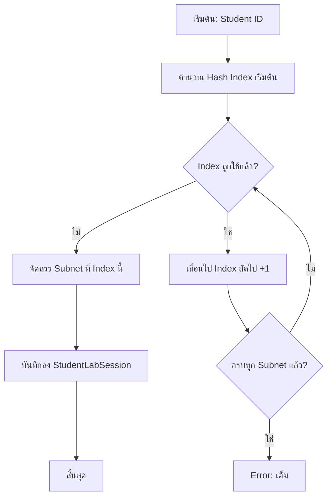

# หลักการของอัลกอริทึมคำนวณ VLAN ID และค่า IP ของอุปกรณ์ (Large Subnet Mode)

## ภาพรวมของอัลกอริทึม

อัลกอริทึมนี้ถูกพัฒนาขึ้นโดยเฉพาะสำหรับการจัดสอบในรายวิชา Communication Network Infrastructure โดยมีวัตถุประสงค์หลักเพื่อจัดสรรที่อยู่ IP และหมายเลข VLAN ให้กับนักศึกษาแบบ **Large Subnet Mode** ซึ่งจะทำให้นักศึกษาแต่ละคนได้รับ Subnet ที่ไม่ซ้ำกันภายใน Private Network Pool ขนาดใหญ่

**Large Subnet Mode** ได้รับการออกแบบมาเพื่อ:
- จัดสรร Subnet ส่วนตัวให้แต่ละนักศึกษาอย่างอัตโนมัติ
- รองรับการแบ่ง Sub-VLAN หลายเครือข่ายภายใน Subnet ที่จัดสรรให้
- สุ่มหรือกำหนด VLAN ID แบบคงที่สำหรับแต่ละ Sub-VLAN
- ป้องกันการชนกันของ Subnet ระหว่างนักศึกษา

---

## การตั้งค่าเบื้องต้นสำหรับ Large Subnet Mode

ผู้สร้าง Lab จะต้องกำหนดค่าเริ่มต้นดังต่อไปนี้:

### 1. Private Network Pool

ระบุ Network Pool ที่จะใช้จัดสรร Subnet ให้นักศึกษา โดยรองรับ 3 ขนาด:

| Private Network Pool | Prefix Length | จำนวนที่อยู่ทั้งหมด |
|---------------------|--------------|-------------------|
| `10.0.0.0/8`        | /8           | 16,777,216        |
| `172.16.0.0/12`     | /12          | 1,048,576         |
| `192.168.0.0/16`    | /16          | 65,536            |

### 2. Student Subnet Size

กำหนดขนาด Subnet ที่จัดสรรให้แต่ละนักศึกษา เช่น:
- `/23` = 512 IP addresses ต่อนักศึกษา
- `/24` = 256 IP addresses ต่อนักศึกษา
- `/25` = 128 IP addresses ต่อนักศึกษา

### 3. Sub-VLAN Configuration

กำหนดการแบ่ง Sub-VLAN ภายใน Student Subnet โดยแต่ละ Sub-VLAN ประกอบด้วย:

| พารามิเตอร์ | คำอธิบาย |
|------------|---------|
| `name` | ชื่อของ Sub-VLAN (เช่น "VLAN A", "Data VLAN") |
| `subnetSize` | ขนาด Subnet ของ Sub-VLAN (เช่น /26 = 64 IP) |
| `subnetIndex` | ลำดับของ Sub-VLAN ภายใน Student Subnet (เริ่มจาก 1) |
| `vlanIdRandomized` | `true` = สุ่ม VLAN ID, `false` = ใช้ค่าคงที่ |
| `fixedVlanId` | VLAN ID คงที่ (ใช้เมื่อ vlanIdRandomized = false) |

---

## การคำนวณจำนวน Subnet ที่พร้อมใช้งาน

จำนวน Subnets ที่สามารถจัดสรรได้คำนวณจากสูตร:

$$\text{totalSubnets} = 2^{(\text{studentSubnetSize} - \text{poolPrefixLength})}$$

**ตัวอย่างการคำนวณ:**

สมมุติใช้ Pool `10.0.0.0/8` และ Student Subnet Size `/23`:

$$\text{totalSubnets} = 2^{(23 - 8)} = 2^{15} = 32,768 \text{ subnets}$$

หมายความว่าสามารถรองรับนักศึกษาได้สูงสุด 32,768 คนพร้อมกัน

---

## อัลกอริทึมการจัดสรร Subnet ให้นักศึกษา

### หลักการ Hash-Based Allocation

ระบบใช้ **Knuth's Multiplicative Hash** เพื่อกระจาย Subnet Index ให้นักศึกษาแต่ละคนอย่างสม่ำเสมอ โดยใช้ค่า Golden Ratio Prime เป็นตัวคูณ

**สูตรการคำนวณ Subnet Index เริ่มต้น:**

$$\text{initialIndex} = \left( (\text{studentId} \times 2654435761) \mod 2^{32} \right) \mod \text{totalSubnets}$$

**ความหมายของตัวแปร:**
- `studentId` = รหัสนักศึกษา (แปลงเป็นตัวเลข)
- `2654435761` = Golden Ratio Prime สำหรับ 32-bit hash
- `totalSubnets` = จำนวน Subnet ทั้งหมดที่พร้อมใช้งาน

> **💡 ทำไมใช้ Golden Ratio Prime (2654435761)?**
>
> ค่านี้มาจากสูตร: $2^{32} \div \varphi \approx 2654435769$ (โดย $\varphi$ = 1.618... คือ Golden Ratio)
>
> **ข้อดีพิเศษ:**
> - **กระจายสม่ำเสมอ**: Golden Ratio มีคุณสมบัติ "irrational" ที่สุด ทำให้ผลคูณกระจายตัวดีที่สุด
> - **ลด Clustering**: ไม่เกิดกลุ่มก้อนของ Index ที่ซ้ำกันบ่อย
> - **Deterministic**: Input เดียวกันได้ Output เดียวกันเสมอ
> - **เร็ว**: แค่คูณ 1 ครั้ง + modulo ไม่ต้อง iterate

### การแก้ปัญหาการชนกัน (Collision Resolution)

เมื่อ Subnet Index ที่คำนวณได้ถูกใช้งานแล้ว ระบบจะใช้วิธี **+1 Wraparound**:

1. ตรวจสอบว่า Subnet Index ที่คำนวณได้ว่างหรือไม่
2. หากถูกใช้แล้ว เลื่อนไปยัง Index ถัดไป (+1)
3. ทำซ้ำจนกว่าจะพบ Index ว่าง หรือวนครบทุก Subnet
4. หากครบทุก Subnet แล้วไม่มีว่าง ส่ง Error "All subnets are allocated"

**Flowchart แสดงการทำงาน:**



### การป้องกัน Race Condition

ระบบใช้ **Unique Index** ในฐานข้อมูล MongoDB เพื่อป้องกันการจัดสรร Subnet ซ้ำ:

```
Unique Index: { labId, allocatedSubnetIndex, status: 'active' }
```

หาก Session สองรายการพยายามจองสร้าง Index เดียวกัน ฐานข้อมูลจะ reject และ Service Layer จะ retry ด้วย Index ถัดไป

---

## การคำนวณ Network Address จาก Subnet Index

เมื่อได้ Subnet Index แล้ว ระบบจะคำนวณ Network Address ดังนี้:

**สูตรการคำนวณ:**

$$\text{subnetSize} = 2^{(32 - \text{studentSubnetSize})}$$

$$\text{networkNum} = \text{poolBaseAddress} + (\text{subnetIndex} \times \text{subnetSize})$$

**ตัวอย่างการคำนวณ:**

สมมุติ:
- Pool: `10.0.0.0/8` (Base Address = 0x0A000000 = 167,772,160)
- Student Subnet Size: `/23`
- Subnet Index: 517

คำนวณ:
$$\text{subnetSize} = 2^{(32 - 23)} = 2^9 = 512$$

$$\text{networkNum} = 167,772,160 + (517 \times 512) = 167,772,160 + 264,704 = 168,036,864$$

แปลงเป็น IP:
$$168,036,864 = 10.4.4.0$$

ดังนั้น Student Subnet CIDR = `10.4.4.0/23`

---

## การจัดสรร VLAN ID

ระบบรองรับการกำหนด VLAN ID ได้ 2 รูปแบบ:

### 1. Randomized VLAN ID

สำหรับ Sub-VLAN ที่ตั้งค่า `vlanIdRandomized: true`:
- สุ่ม VLAN ID ในช่วง **2-4094** (IEEE 802.1Q Standard)
- ตรวจสอบความไม่ซ้ำกันภายใน Session เดียวกัน
- เก็บค่าลงฐานข้อมูลเพื่อใช้ซ้ำตลอด Lab Session

### 2. Fixed VLAN ID

สำหรับ Sub-VLAN ที่ตั้งค่า `vlanIdRandomized: false`:
- ใช้ค่า `fixedVlanId` ที่ผู้สร้าง Lab กำหนดไว้
- เหมาะสำหรับกรณีที่ต้องการ VLAN ID เฉพาะ (เช่น Management VLAN, Native VLAN)

### ตารางเปรียบเทียบรูปแบบ VLAN ID

| รูปแบบ | ช่วงค่า | ความไม่ซ้ำกัน | กรณีใช้งาน |
|-------|--------|-------------|-----------|
| Randomized | 2-4094 | ไม่ซ้ำภายใน Session | Data VLANs, Voice VLANs |
| Fixed | ตามที่กำหนด | ไม่รับประกัน | Management VLAN, Native VLAN |

---

## การคำนวณ IP Address ภายใน Sub-VLAN

### หลักการพื้นฐาน

แต่ละ Sub-VLAN เป็น Subnet ย่อยภายใน Student's Allocated Subnet โดย IP Address คำนวณจาก:

1. **Student Network Address** - จุดเริ่มต้นของ Subnet ที่จัดสรรให้นักศึกษา
2. **Sub-VLAN Block Start** - ตำแหน่งเริ่มต้นของ Sub-VLAN ภายใน Student Subnet
3. **Interface Offset** - ตำแหน่งของอุปกรณ์ภายใน Sub-VLAN

### สูตรการคำนวณ

**ขั้นตอนที่ 1: คำนวณขนาด Sub-VLAN Block**

$$\text{subVlanBlockSize} = 2^{(32 - \text{subVlanSubnetSize})}$$

**ขั้นตอนที่ 2: คำนวณจุดเริ่มต้นของ Sub-VLAN**

$$\text{subVlanStart} = \text{studentNetworkNum} + ((\text{subnetIndex} - 1) \times \text{subVlanBlockSize})$$

**ขั้นตอนที่ 3: คำนวณ IP Address สุดท้าย**

$$\text{ipAddress} = \text{subVlanStart} + \text{interfaceOffset}$$

### ตัวอย่างการคำนวณแบบละเอียด

**สมมุติข้อมูลดังนี้:**
- Student Allocated Subnet: `10.4.4.0/23`
- Sub-VLAN Configuration:
  - Sub-VLAN A: `/26`, subnetIndex = 1
  - Sub-VLAN B: `/26`, subnetIndex = 2
  - Sub-VLAN C: `/26`, subnetIndex = 3
- Interface Offset: 1 (Router Gateway)

**การคำนวณ Sub-VLAN A:**

1. แปลง Network Address เป็นตัวเลข:
   $$10.4.4.0 = (10 \times 2^{24}) + (4 \times 2^{16}) + (4 \times 2^8) + 0 = 168,037,376$$

2. คำนวณขนาด Sub-VLAN Block:
   $$\text{subVlanBlockSize} = 2^{(32 - 26)} = 2^6 = 64$$

3. คำนวณจุดเริ่มต้น Sub-VLAN A (subnetIndex = 1):
   $$\text{subVlanStart} = 168,037,376 + ((1 - 1) \times 64) = 168,037,376$$

4. คำนวณ IP Address (offset = 1):
   $$\text{ipAddress} = 168,037,376 + 1 = 168,037,377$$

5. แปลงเป็น Dotted Decimal:
   $$168,037,377 = 10.4.4.1$$

**สรุปผลลัพธ์ทั้งหมด:**

| Sub-VLAN | Subnet Index | Block Start | Network Address | Gateway (offset=1) |
|----------|-------------|-------------|-----------------|-------------------|
| A        | 1           | 168,037,376 | 10.4.4.0/26     | 10.4.4.1         |
| B        | 2           | 168,037,440 | 10.4.4.64/26    | 10.4.4.65        |
| C        | 3           | 168,037,504 | 10.4.4.128/26   | 10.4.4.129       |

---

## การจัดการ Session และการบันทึกข้อมูล

### โครงสร้างข้อมูลที่บันทึก

เมื่อนักศึกษาเริ่ม Lab ระบบจะบันทึกข้อมูลการจัดสรรลง **StudentLabSession**:

| ฟิลด์ | คำอธิบาย | ตัวอย่าง |
|------|---------|---------|
| `allocatedSubnetIndex` | Index ใน Pool ที่จัดสรรให้ | 517 |
| `allocatedSubnetCIDR` | Subnet ในรูป CIDR | "10.4.4.0/23" |
| `networkAddress` | Network Address | "10.4.4.0" |
| `randomizedVlanIds` | รายการ VLAN ID ที่สุ่มได้ | [247, 1892, 3401] |
| `allocatedAt` | เวลาที่จัดสรร | 2024-01-15T10:30:00Z |

### การใช้ซ้ำ Allocation เดิม

เมื่อนักศึกษากลับมาทำ Lab ที่ยังไม่เสร็จ:
1. ระบบตรวจสอบว่ามี Active Session อยู่หรือไม่
2. หากมี ให้ใช้ Allocation เดิมจาก Session ที่มีอยู่
3. ค่า IP และ VLAN ID จะคงเดิมตลอด Lab Session

### การ Release Allocation

Allocation จะถูก Release เมื่อ:
- นักศึกษาทำ Lab สำเร็จ (Session status = 'completed')
- Lab หมดอายุ (Deadline ผ่านไปแล้ว)
- Admin ทำการ Reset Session

---

## การรองรับ Management IP

### การจัดสรร Management IP

Management IP ถูกจัดสรรแยกจาก Large Subnet Allocation:

1. **Pool**: ใช้ Management Network ที่ผู้สร้าง Lab กำหนด
2. **Allocation**: ใช้วิธี First-Fit (หา IP ว่างตัวแรก)
3. **Exempt Ranges**: ข้าม IP ที่อยู่ในช่วงสงวน

### การใช้งานร่วมกับ Large Subnet Mode

อุปกรณ์สามารถมี Interface หลายประเภท:
- **Management Interface**: ใช้ IP จาก Management Pool
- **Sub-VLAN Interface**: ใช้ IP จาก Large Subnet Allocation

---

## ตัวอย่างการทำงานครบวงจร

### สถานการณ์

- **Student ID**: 65070041
- **Lab Configuration**:
  - Private Network Pool: `10.0.0.0/8`
  - Student Subnet Size: `/23`
  - Sub-VLANs:
    1. "Data VLAN" - /26, subnetIndex=1, randomized
    2. "Voice VLAN" - /26, subnetIndex=2, randomized
    3. "Management VLAN" - /26, subnetIndex=3, fixed=99

### ขั้นตอนการทำงาน

**1. คำนวณ Total Subnets**

$$\text{totalSubnets} = 2^{(23 - 8)} = 32,768$$

**2. Hash Student ID to Initial Index**

$$\text{hash} = ((65070041 \times 2654435761) \mod 2^{32}) \mod 32,768$$

$$= (172,594,458,174,069,001 \mod 4,294,967,296) \mod 32,768$$

$$= 3,025,234,185 \mod 32,768$$

$$= 15,241$$

**3. ตรวจสอบ Collision และจัดสรร**

สมมุติ Index 15,241 ว่าง ระบบจัดสรรให้ทันที

**4. คำนวณ Network Address**

$$\text{subnetSize} = 2^9 = 512$$

$$\text{networkNum} = 167,772,160 + (15,241 \times 512) = 175,575,552$$

$$= 10.119.66.0$$

Student Subnet: `10.119.66.0/23`

**5. สุ่ม/กำหนด VLAN IDs**

| Sub-VLAN | Mode | VLAN ID |
|----------|------|---------|
| Data VLAN | Randomized | 847 (สุ่ม) |
| Voice VLAN | Randomized | 3256 (สุ่ม) |
| Management VLAN | Fixed | 99 |

**6. คำนวณ IP สำหรับแต่ละ Sub-VLAN**

| Sub-VLAN | Network | Gateway (offset=1) | PC (offset=2) |
|----------|---------|-------------------|---------------|
| Data VLAN | 10.119.66.0/26 | 10.119.66.1 | 10.119.66.2 |
| Voice VLAN | 10.119.66.64/26 | 10.119.66.65 | 10.119.66.66 |
| Management VLAN | 10.119.66.128/26 | 10.119.66.129 | 10.119.66.130 |

---

## ข้อจำกัดและข้อควรระวัง

### ข้อจำกัดทางเทคนิค

1. **ขนาด Pool**: Private Network Pool I
มีขนาดจำกัด ต้องวางแผนให้เพียงพอกับจำนวนนักศึกษา
2. **VLAN ID Range**: IEEE 802.1Q กำหนดช่วง 1-4094 เท่านั้น (VLAN 1 และ 4095 สงวนไว้)
3. **Sub-VLAN ต้องอยู่ภายใน Student Subnet**: ผลรวมของ Sub-VLAN blocks ต้องไม่เกินขนาด Student Subnet

### ข้อควรระวังในการออกแบบ Lab

1. **Student Subnet Size**: เลือกให้เหมาะสมกับจำนวน Sub-VLANs
2. **Sub-VLAN SubnetIndex**: ต้องไม่ซ้ำกันภายใน Lab เดียวกัน
3. **Interface Offset**: 
   - Offset 0 = Network Address (ห้ามใช้)
   - Offset 1-254 = Usable hosts
   - Offset สูงสุดขึ้นอยู่กับ Sub-VLAN size

### การคำนวณ Capacity

$$\text{maxStudents} = \frac{2^{(32 - \text{poolPrefix})}}{2^{(32 - \text{studentSubnetSize})}}$$

| Pool | Student Size | Max Students |
|------|-------------|--------------|
| /8   | /23         | 32,768       |
| /8   | /24         | 65,536       |
| /12  | /24         | 4,096        |
| /16  | /26         | 1,024        |

---

## สรุป

**Large Subnet Mode** เป็นอัลกอริทึมที่ออกแบบมาเพื่อ:

1. **Scalability**: รองรับนักศึกษาจำนวนมากด้วย Hash-based allocation
2. **Uniqueness**: มั่นใจได้ว่าแต่ละนักศึกษาได้ Subnet ไม่ซ้ำกัน
3. **Flexibility**: รองรับ Sub-VLANs หลายเครือข่ายด้วย VLAN ID แบบสุ่มหรือคงที่
4. **Persistence**: เก็บ Allocation ไว้ตลอด Lab Session เพื่อความคงเส้นคงวา
5. **Conflict Prevention**: ใช้ Database Unique Index ป้องกัน Race Condition

---

# 📊 สรุปสำหรับสไลด์นำเสนอ

## Large Subnet Mode คืออะไร?

> ระบบจัดสรร **Subnet ส่วนตัว** ให้นักศึกษาแต่ละคนอัตโนมัติ  
> ไม่ต้องกำหนด IP เองทีละคน รองรับนักศึกษาจำนวนมากได้

---

## 🎯 แนวคิดหลัก

```
┌─────────────────────────────────────────────────┐
│         Private Network Pool (เช่น 10.0.0.0/8)  │
├────────┬────────┬────────┬────────┬─────────────┤
│ Student│ Student│ Student│ Student│    ...      │
│  /23   │  /23   │  /23   │  /23   │             │
│ 512 IP │ 512 IP │ 512 IP │ 512 IP │             │
└────────┴────────┴────────┴────────┴─────────────┘
     ▲
     └─── แต่ละนักศึกษาได้ Subnet ไม่ซ้ำกัน
```

---

## 📐 สูตรสำคัญ 3 ข้อ

### 1. จำนวน Subnet ที่รองรับได้
```
Total Subnets = 2^(StudentSubnetSize - PoolPrefix)

ตัวอย่าง: Pool /8, Student /23  
= 2^(23-8) = 32,768 คน
```

### 2. หา Subnet Index จาก Student ID (Hash)
```
Index = (StudentID × 2654435761) mod TotalSubnets

หากชนกัน → เลื่อนไป +1 จนเจอช่องว่าง
```

### 3. คำนวณ IP ใน Sub-VLAN
```
IP = NetworkAddress + (SubnetIndex-1) × BlockSize + Offset

ตัวอย่าง: 10.4.4.0 + (1-1)×64 + 1 = 10.4.4.1
```

---

## 🔄 ขั้นตอนการทำงาน

```
Student ID ──▶ Hash ──▶ Subnet Index ──▶ Network Address
                             │
                             ▼
                   ┌─────────────────┐
                   │ 10.119.66.0/23  │ ◀── Student Subnet
                   ├─────────────────┤
                   │ Sub-VLAN A /26  │ ──▶ 10.119.66.0-63
                   │ Sub-VLAN B /26  │ ──▶ 10.119.66.64-127  
                   │ Sub-VLAN C /26  │ ──▶ 10.119.66.128-191
                   └─────────────────┘
```

---

## 🎲 VLAN ID: สุ่ม vs คงที่

| โหมด | ช่วงค่า | ใช้กับ |
|-----|--------|-------|
| **Randomized** | 2-4094 | Data VLAN, Voice VLAN |
| **Fixed** | ตามกำหนด | Management VLAN, Native VLAN |

---

## ✅ ข้อดีของระบบ

| ข้อดี | รายละเอียด |
|------|-----------|
| 🚀 **Scalable** | รองรับ 32,000+ นักศึกษาพร้อมกัน |
| 🔒 **ไม่ซ้ำกัน** | Hash + Collision Resolution |
| 💾 **คงที่ตลอด Lab** | บันทึกใน Session ไม่เปลี่ยน |
| ⚡ **อัตโนมัติ** | ไม่ต้องกำหนดมือ |

---

## 📌 ตัวอย่างผลลัพธ์

**นักศึกษา: 65070041**

| รายการ | ค่าที่ได้ |
|--------|---------|
| Subnet Index | 15,241 |
| Student Subnet | `10.119.66.0/23` |
| Data VLAN | ID: 847, Network: `10.119.66.0/26` |
| Voice VLAN | ID: 3256, Network: `10.119.66.64/26` |
| Mgmt VLAN | ID: 99 (fixed), Network: `10.119.66.128/26` |

---

## 🔑 Key Takeaways

1. **1 นักศึกษา = 1 Subnet ส่วนตัว** (ไม่ซ้ำกัน)
2. **Hash-based** = กระจายสม่ำเสมอ + Deterministic
3. **Sub-VLANs** = แบ่งซอยเครือข่ายย่อยได้หลายอัน
4. **VLAN ID** = สุ่มหรือกำหนดเองได้
5. **Persistent** = ค่าคงที่ตลอด Lab Session

---

# 🌐 สรุป IPv6 สำหรับสไลด์นำเสนอ

## IPv6 ในระบบ NetGrader คืออะไร?

> ระบบสร้าง **IPv6 Address ที่ไม่ซ้ำกัน** ให้นักศึกษาแต่ละคนอัตโนมัติ  
> โดยใช้ **Template** ที่ปรับแต่งได้ + ตัวแปรจากรหัสนักศึกษา

---

## 🎯 รูปแบบ IPv6 พื้นฐาน

```
2001 : {X} : {Y} : {VLAN} :: {offset} /64
  │      │     │      │        │      │
  │      │     │      │        │      └─ Prefix Length
  │      │     │      │        └─ Interface ID (1, 2, 3...)
  │      │     │      └─ VLAN ID (141, 241, A, B...)
  │      │     └─ Sequence Number (41)
  │      └─ Year+Faculty (6507)
  └─ Global Prefix
```

---

## 📐 ตัวแปรจากรหัสนักศึกษา

**รหัสนักศึกษา: 65070041**

| ตัวแปร | สูตร | ค่า | คำอธิบาย |
|--------|------|-----|---------|
| `{X}` | Year×100 + Faculty | `6507` | ปี×100 + รหัสคณะ |
| `{Y}` | Sequence | `41` | ลำดับนักศึกษา |
| `{Z}` | Seq % 1000 | `41` | ⚠️ ซ้ำกับ Y (ดูหมายเหตุ) |
| `{last3}` | Last 3 digits | `041` | 3 ตัวท้าย (เก็บเลขศูนย์) |
| `{VLAN}` | From config | `141` | VLAN ID |
| `{offset}` | Interface # | `1` | ลำดับ Interface |

> ⚠️ **หมายเหตุเกี่ยวกับ {Z}**: ในระบบปัจจุบัน sequence number ไม่เกิน 100 (นักศึกษาต่อคณะต่อปี)
> ดังนั้น `{Z}` = seq % 1000 จะได้ค่าเหมือน `{Y}` เสมอ
>
> **TODO**: พิจารณาลบ {Z} ออกหรือเปลี่ยนสูตรให้มีประโยชน์มากกว่านี้

---

## 📝 Template Presets ที่มีให้

| ชื่อ | Template | ตัวอย่างผลลัพธ์ |
|-----|----------|----------------|
| **Standard Exam** | `2001:{X}:{Y}:{VLAN}::{offset}/64` | `2001:6507:41:141::1/64` |
| **University Network** | `2001:3c8:1106:4{last3}:{VLAN}::{offset}/64` | `2001:3c8:1106:4041:141::1/64` |
| **Simple Lab** | `2001:db8:{X}:{VLAN}::{offset}/64` | `2001:db8:6507:141::1/64` |

---

## 🔄 ขั้นตอนการทำงาน

```
┌──────────────┐    ┌──────────────┐    ┌──────────────┐
│ Student ID   │───▶│ คำนวณตัวแปร  │───▶│ แทนค่า       │
│ 65070041     │    │ X=6507, Y=41 │    │ ใน Template  │
└──────────────┘    └──────────────┘    └──────────────┘
                                               │
                                               ▼
                                    ┌──────────────────────┐
                                    │ 2001:6507:41:141::1/64│
                                    └──────────────────────┘
```

---

## 🔒 Management Network Override

> **ปัญหา**: IPv6 ปกติอาจผ่าน Firewall ของมหาวิทยาลัยไม่ได้  
> **ทางแก้**: ใช้ Fixed Prefix พิเศษสำหรับ Management Network

**รูปแบบ Management IPv6:**

```
2001:3c8:1106:4306::{last3}/64

ตัวอย่าง: นักศึกษา 65070041
→ 2001:3c8:1106:4306::41/64
```

| ตั้งค่า | ค่า | หมายเหตุ |
|--------|-----|---------|
| `fixedPrefix` | `2001:3c8:1106:4306` | Prefix ที่ผ่าน Firewall ได้ |
| `useStudentIdSuffix` | `true` | ใช้ 3 ตัวท้ายเป็น Interface ID |

---

## 🆚 IPv4 vs IPv6 เปรียบเทียบ

| หัวข้อ | IPv4 | IPv6 |
|-------|------|------|
| **การคำนวณ** | Hash-based (Large Subnet) | Template-based |
| **ความยาว** | 32-bit | 128-bit |
| **รูปแบบ** | `10.119.66.1` | `2001:6507:41:141::1` |
| **VLAN ในที่อยู่** | ไม่มี (แยก Subnet) | มี (ฝังใน Address) |
| **Prefix** | /23, /24, /26 | /64 (มาตรฐาน) |

---

## ✨ ประเภท IPv6 Input ที่รองรับ

| ประเภท | คำอธิบาย | ตัวอย่าง |
|--------|---------|---------|
| `fullIPv6` | กำหนดเอง | `2001:db8::1/64` |
| `linkLocal` | Link-Local | `fe80::1` |
| `studentVlan6_0` | VLAN A ของนักศึกษา | `2001:6507:41:141::1/64` |
| `studentVlan6_1` | VLAN B ของนักศึกษา | `2001:6507:41:241::1/64` |
| `subVlan6_0` | Sub-VLAN (Large Mode) | ใช้กับ Large Subnet Mode |

---

## 📌 ตัวอย่างผลลัพธ์จริง

**นักศึกษา: 65070041, Template: Standard Exam**

| Interface | VLAN | IPv6 Address |
|-----------|------|--------------|
| Router Gig0/0 | 141 | `2001:6507:41:141::1/64` |
| Router Gig0/1 | 241 | `2001:6507:41:241::2/64` |
| PC1 | 141 | `2001:6507:41:141::10/64` |
| Management | - | `2001:3c8:1106:4306::41/64` |

---

## 🔑 Key Takeaways (IPv6)

1. **Template-based** = ยืดหยุ่น ปรับแต่งได้
2. **Student Variable** = {X}, {Y}, {last3} สร้างความไม่ซ้ำ
3. **VLAN ฝังใน Address** = ง่ายต่อการ Debug
4. **Management Override** = ผ่าน Firewall ด้วย Fixed Prefix
5. **3 Presets** = Standard, University, Simple Lab
