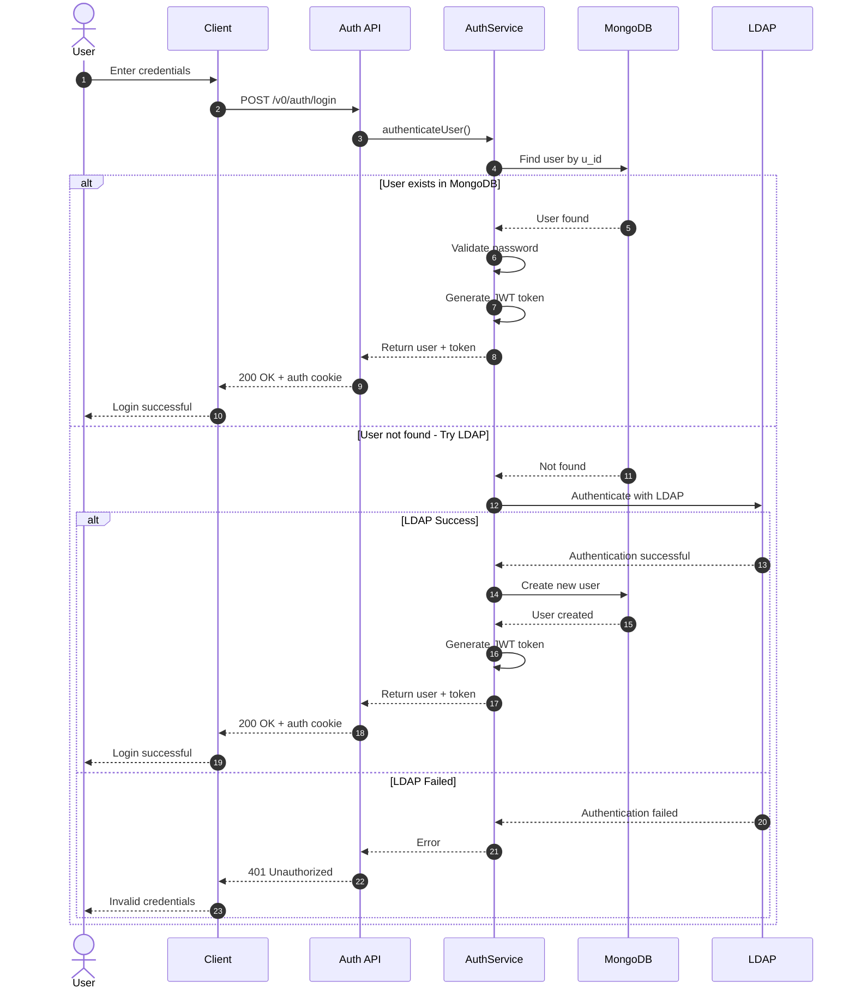

# UC-001: User Authentication

## Overview
This sequence diagram shows the authentication flow where users can log in using either MongoDB credentials or LDAP authentication.

## Mermaid Diagram

## Key Components

### Services
- **Auth API**: `src/modules/auth/index.ts`
- **AuthService**: `src/modules/auth/service.ts`
- **MongoDB**: Users collection
- **LDAP**: External LDAP server

### Main Flow
1. User attempts login through client
2. System checks MongoDB for existing user
3. If found: Validates password and generates JWT
4. If not found: Attempts LDAP authentication
5. If LDAP succeeds: Creates new user in MongoDB
6. Returns JWT token in httpOnly cookie

### Error Scenarios
- **Invalid credentials** (401): Wrong password or LDAP failure
- **User not found** (404): No user in MongoDB or LDAP
