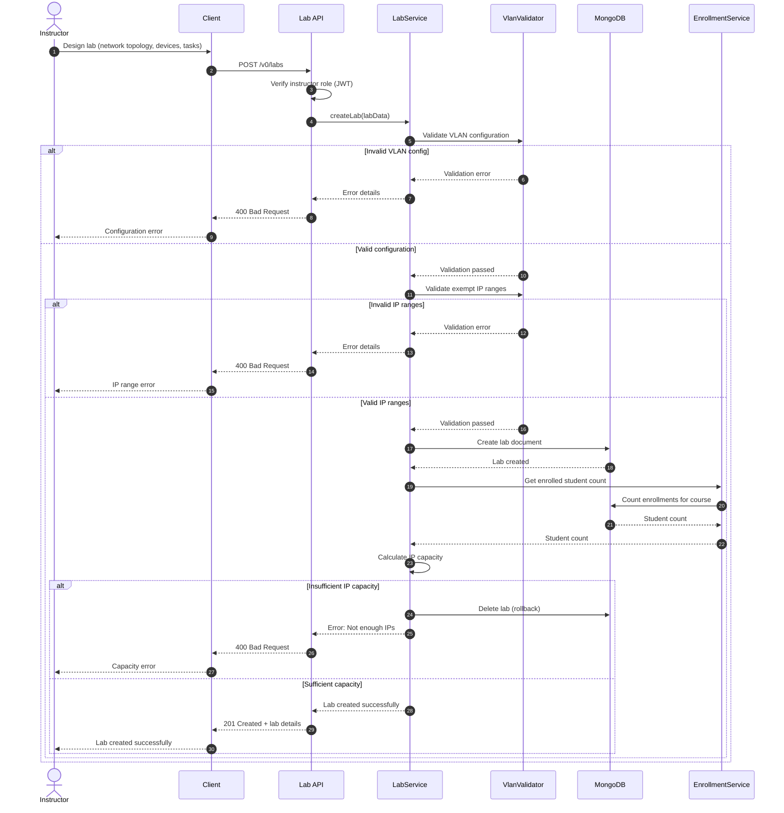

# UC-002: Create Lab

## Overview
This sequence diagram shows how instructors create a new lab with network topology, VLAN configuration, and device setup.

## Mermaid Diagram

## Key Components

### Services
- **Lab API**: `src/modules/labs/index.ts`
- **LabService**: `src/modules/labs/service.ts`
- **VlanValidator**: `src/utils/vlan-validator.ts`
- **EnrollmentService**: `src/modules/enrollments/service.ts`
- **MongoDB**: Labs and enrollments collections

### Main Flow
1. Instructor designs lab with network topology and devices
2. System validates VLAN configuration
3. System validates exempt IP ranges
4. Lab document is created in MongoDB
5. System checks if IP capacity is sufficient for enrolled students
6. If capacity is insufficient, lab creation is rolled back

### Error Scenarios
- **Invalid VLAN configuration** (400): VLAN settings don't meet requirements
- **Invalid IP ranges** (400): Exempt ranges overlap or invalid format
- **Insufficient IP capacity** (400): Not enough IPs for enrolled students
- **Unauthorized** (401): Non-instructor attempting to create lab
