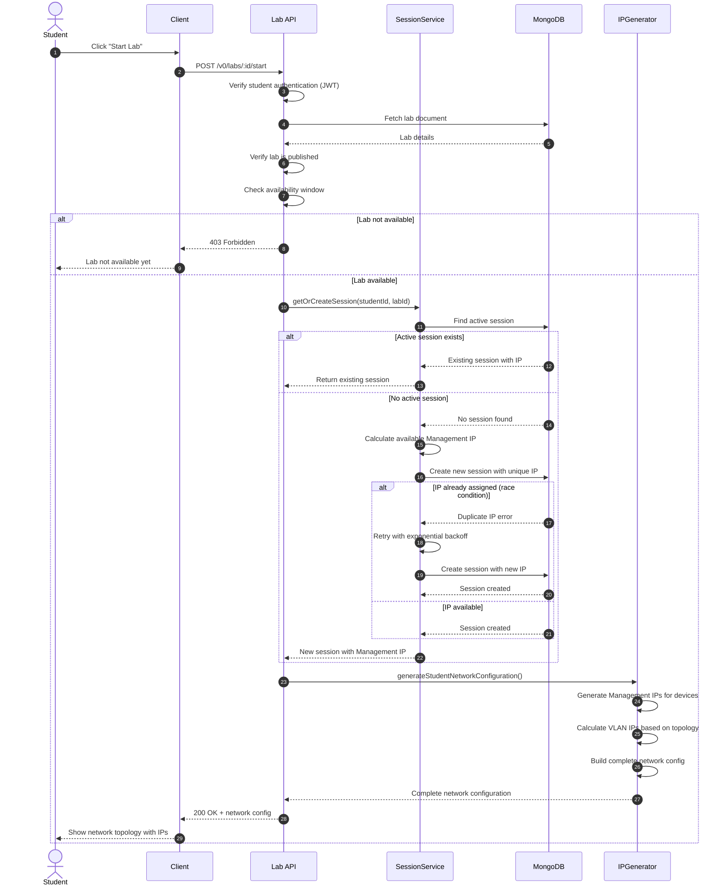

# UC-003: Start Lab (Get Network Configuration)

## Overview
This sequence diagram shows how students start a lab and receive their personalized network configuration with unique IP assignments.

## Mermaid Diagram

## Key Components

### Services
- **Lab API**: `src/modules/labs/index.ts`
- **SessionService**: `src/modules/student-lab-sessions/service.ts`
- **IPGenerator**: `src/modules/submissions/ip-generator.ts`
- **MongoDB**: Labs and student_lab_sessions collections

### Main Flow
1. Student requests to start a lab
2. System verifies lab is published and within availability window
3. System checks for existing active session
4. If no session exists, calculates and assigns unique Management IP
5. System generates complete network configuration (Management + VLAN IPs)
6. Returns personalized network topology to student

### IP Assignment
- Each student gets a unique Management IP from the base network
- VLAN IPs are calculated based on VLAN configuration mode:
  - **Fixed VLAN**: Predefined VLAN IDs
  - **Lecturer Group**: VLAN based on student group
  - **Calculated VLAN**: VLAN calculated using multipliers

### Error Scenarios
- **Lab not available** (403): Outside availability window or not published
- **Unauthorized** (401): Student not authenticated
- **IP exhaustion** (500): No available IPs in pool
- **Race condition**: Handled by retry with exponential backoff
