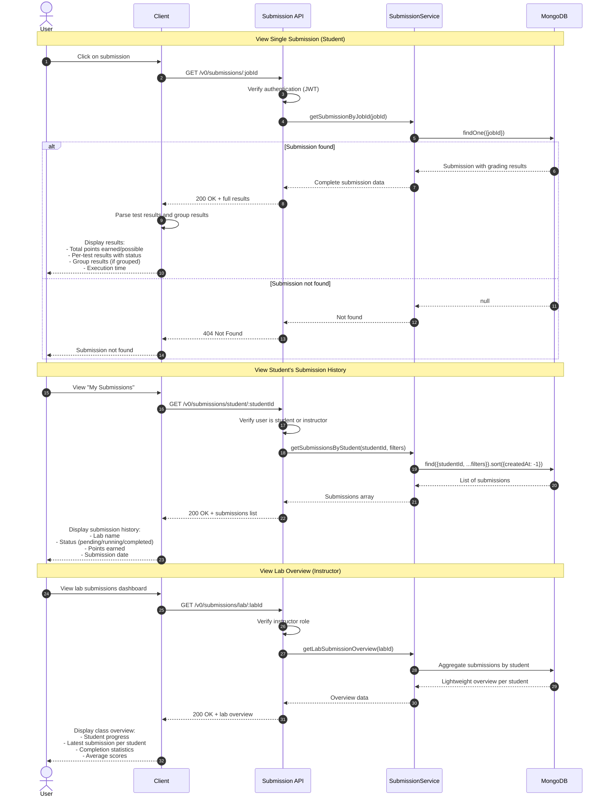

# UC-006: View Submission Results

## Overview
This sequence diagram shows how students and instructors view grading results through three different endpoints: single submission details, student submission history, and lab overview for instructors.

## Mermaid Diagram

## Key Components

### Services
- **Submission API**: `src/modules/submissions/index.ts`
- **SubmissionService**: `src/modules/submissions/service.ts`
- **MongoDB**: Submissions collection

### Three Query Patterns

#### 1. By Job ID (Single Submission)
**Endpoint**: `GET /v0/submissions/:jobId`

**Returns**:
- Complete submission with full grading results
- Test results for each task (status, points, output)
- Group results (if tasks are grouped)
- Total execution time and timestamps

**Use Case**: Student views detailed results for a specific submission

#### 2. By Student ID (Submission History)
**Endpoint**: `GET /v0/submissions/student/:studentId`

**Query Parameters**:
- `labId`: Filter by specific lab
- `status`: Filter by status (pending/running/completed)
- `limit`: Pagination limit
- `offset`: Pagination offset

**Returns**:
- Array of all submissions by student
- Basic info: lab name, status, points, date

**Use Case**: Student reviews their submission history across all labs

#### 3. By Lab ID (Instructor Overview)
**Endpoint**: `GET /v0/submissions/lab/:labId`

**Returns**:
- Lightweight overview (doesn't fetch full results)
- Latest submission per student
- Student progress indicators
- Class-wide statistics

**Use Case**: Instructor monitors class progress on specific lab

## Result Data Structure

### Test Result
- **test_name**: Task identifier
- **status**: passed, failed, or error
- **message**: Result description
- **points_earned**: Points awarded
- **points_possible**: Total possible points
- **execution_time**: Time taken
- **test_case_results**: Individual test case outcomes
- **raw_output**: Command output from device

### Group Result
- **group_id**: Group identifier
- **title**: Group name
- **status**: passed, failed, or cancelled
- **group_type**: all_or_nothing or proportional
- **points_earned/possible**: Group scoring
- **task_results**: Array of test results in group

## Error Scenarios
- **Submission not found** (404): Invalid jobId
- **Unauthorized** (401): User not authenticated
- **Forbidden** (403): Student accessing another student's results
- **Invalid filters** (400): Malformed query parameters
